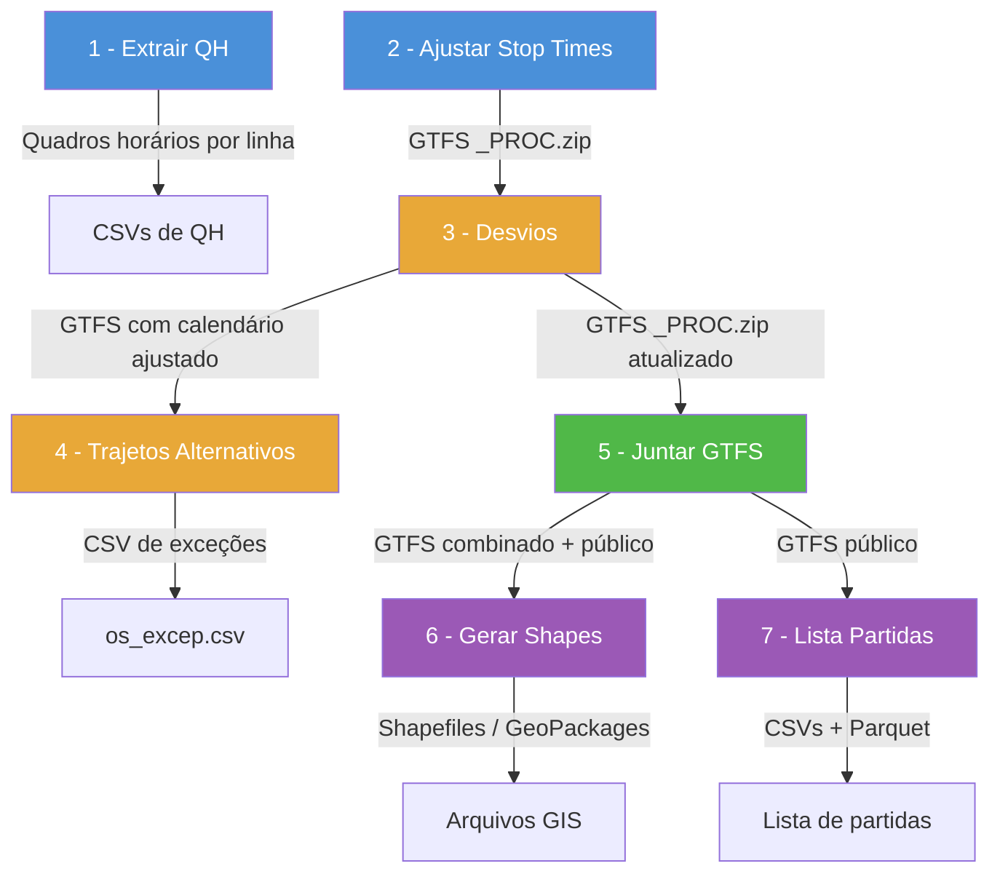

# Resumo dos Códigos Python — `codigos_py/`

Os 7 scripts formam um **pipeline sequencial** de processamento de dados GTFS para o transporte público do Rio de Janeiro. Cada script lê a saída do anterior e produz insumos para o próximo.

---

## 1️⃣ `1_extrair_qh_especificado_no_gtfs.py`
**Objetivo:** Extrair o Quadro Horário (QH) de linhas específicas, a partir do GTFS combinado.

| Item | Descrição |
|------|-----------|
| **Entrada** | Arquivo GTFS ZIP combinado (`gtfs_combi_YYYY-MM-QQ.zip`) — tabelas `frequencies.txt` e `trips.txt` |
| **Filtros** | Lista de linhas (`linhas_rodar`) e calendários (`services_to_run`, ex: `U_REG`, `S_REG`, `D_REG`) |
| **Processamento** | Junta `frequencies` com `trips`, filtra por linha e serviço, identifica combinações únicas de (serviço, vista, calendário) |
| **Saída** | Um CSV por combinação em `resultados/quadro_horario_extraido/YYYY/MM/qh_por_linha/QQ/` com colunas: `trip_id`, `trip_headsign`, `trip_short_name`, `start_time`, `end_time`, `headway_secs` |
| **Dependências** | `pandas`, `zipfile`, `pathlib` |

---

## 2️⃣ `2_ajustar_stop_times.py`
**Objetivo:** Recalcular os horários de parada (`stop_times`) do GTFS usando **velocidades reais extraídas de dados GPS** de viagens realizadas.

| Item | Descrição |
|------|-----------|
| **Entrada** | GTFS original (SPPO ou BRT) + dados de viagens reais (Parquet/CSV) + calendário de feriados (`calendario.json`) |
| **Etapas** | 1. Carrega viagens GPS (BRT=CSV, SPPO=Parquet + Frescão) |
|  | 2. Calcula sumários de velocidade média por (serviço, direção, hora, tipo de dia) com remoção de outliers via IQR |
|  | 3. Lê GTFS, ajusta `shape_dist_traveled` para começar em 0, corrige horários faltantes usando distância + velocidade padrão |
|  | 4. Recalcula `arrival_time`/`departure_time` usando velocidades GPS reais, garantindo monotonicidade |
|  | 5. Valida integridade (nenhum horário vazio/nulo) |
| **Saída** | Novo ZIP GTFS com sufixo `_PROC.zip` (apenas `stop_times.txt` e `routes.txt` são substituídos) |
| **Dependências** | `pandas`, `numpy`, `zipfile`, `json` |

> [!IMPORTANT]
> Este é o script mais complexo do pipeline (~584 linhas). Ele é o coração do ajuste de qualidade do GTFS.

---

## 3️⃣ `3_desvios.py`
**Objetivo:** Ajustar o calendário (`calendar`, `calendar_dates`) e os `service_id` das viagens do GTFS para refletir **desvios operacionais temporários** (eventos, obras, etc.).

| Item | Descrição |
|------|-----------|
| **Entrada** | GTFS processado (`_PROC.zip`) + CSVs de insumos locais: `insumos_desvios/linhas_desvios.csv` (quais linhas são afetadas) e `insumos_desvios/descricao_desvios.csv` (datas e códigos dos desvios) |
| **Processamento** | 1. Filtra desvios ativos (data_inicio < hoje < data_fim) |
|  | 2. Linhas **não afetadas** por desvios recebem sufixo `_REG` no `service_id` |
|  | 3. Linhas **afetadas** recebem sufixo `_DESAT_<cod_desvio>` |
|  | 4. Gera entradas em `calendar_dates` para ativar/desativar serviços nas datas do evento |
|  | 5. Filtra datas do calendário pelo período do `feed_info` |
| **Saída** | Sobrescreve o GTFS processado com `trips.txt`, `calendar.txt` e `calendar_dates.txt` atualizados |
| **Dependências** | `pandas`, `numpy`, `zipfile`, `gspread` (importado mas usa CSV local) |

---

## 4️⃣ `4_trajetos_alternativos.py`
**Objetivo:** Gerar um **relatório CSV** dos trajetos alternativos (desvios), listando serviços, vistas, consórcios, sentidos e extensões em km.

| Item | Descrição |
|------|-----------|
| **Entrada** | GTFS processado (`_PROC.zip`) — tabelas `trips`, `routes`, `agency`, `shapes` |
| **Processamento** | 1. Identifica viagens de desvio (trip_headsign contendo `[...]`) |
|  | 2. Remove frescões (`route_type == 200`) |
|  | 3. Calcula extensão geográfica dos shapes via GIS (projeção EPSG:31983) |
|  | 4. Agrupa por (serviço, vista, consórcio, sentido, evento) |
| **Saída** | CSV em `dados/os/os_YYYY-MM-QQ_excep.csv` com colunas: Serviço, Vista, Consórcio, Sentido, Extensão, Evento |
| **Dependências** | `pandas`, `geopandas`, `shapely` |

---

## 5️⃣ `5_juntar_gtfs.py`
**Objetivo:** **Combinar** os GTFS processados do SPPO e do BRT em um único GTFS unificado, aplicar limpezas, cores e gerar versão pública.

| Item | Descrição |
|------|-----------|
| **Entrada** | `sppo_YYYY-MM-QQ_PROC.zip` + `brt_YYYY-MM-QQ_PROC.zip` + insumos (cores, trip_id_fantasma, arquivos de substituição) |
| **Etapas** | 1. Carrega e processa SPPO: define `route_type` (700/200), ajusta `service_id`, remove trips fantasma e sem stop_times |
|  | 2. Carrega e processa BRT: preserva `route_type` original, ajusta `service_id` |
|  | 3. Concatena todos os arquivos GTFS (trips, routes, stops, shapes, etc.) |
|  | 4. Limpeza: remove paradas "APAGAR", colunas desnecessárias, ordena shapes, valida horários |
|  | 5. Salva GTFS combinado e substitui arquivos (calendar_dates, fare_attributes, fare_rules, feed_info) com insumos externos |
|  | 6. Gera versão pública: remove trips EXCEP, aplica cores personalizadas (`gtfs_cores.csv`), salva `gtfs_rio-de-janeiro_pub.zip` |
| **Saída** | `gtfs_combi_YYYY-MM-QQ.zip` (interno) + `gtfs_rio-de-janeiro_pub.zip` (público) |
| **Dependências** | `pandas`, `numpy`, `zipfile` |

> [!TIP]
> A função `clean_gtfs()` implementa uma limpeza em cascata equivalente ao `gtfstools::filter_by_trip_id` do R — remove registros órfãos de todas as tabelas associadas.

---

## 6️⃣ `6_gerar_shapes.py`
**Objetivo:** Gerar **arquivos geoespaciais** (Shapefile + GeoPackage) dos trajetos (linhas) e pontos de parada a partir do GTFS público.

| Item | Descrição |
|------|-----------|
| **Entrada** | GTFS público (`gtfs_rio-de-janeiro_pub.zip`) + `descricao_desvios.csv` (opcional) |
| **Processamento** | 1. Ordena shapes e remove inválidos (< 2 pontos) |
|  | 2. Prioriza shapes por tipo de serviço: U_REG → *_REG → especial U → outros |
|  | 3. Converte coordenadas em `LineString`, projeta para EPSG:31983, calcula extensão |
|  | 4. Enriquece com metadados: consórcio, tipo de rota (regular/BRT/frescão), tarifas, descrição de desvios |
|  | 5. Exporta trajetos (linhas) e pontos de parada |
| **Saída** | Em `dados/shapes/YYYY/`: |
|  | - `shapes_trajetos_YYYY-MM-QQ.shp` + `.gpkg` (trajetos como LineStrings) |
|  | - `shapes_pontos_YYYY-MM-QQ.shp` + `.gpkg` (paradas como Points, com `route_type` agregado) |
| **Dependências** | `pandas`, `numpy`, `geopandas`, `shapely`, `pyogrio` |

---

## 7️⃣ `7_lista_partidas.py`
**Objetivo:** Gerar a **lista completa de partidas** (horários de saída) por tipo de dia, consolidando viagens por frequência e por quadro horário regular.

| Item | Descrição |
|------|-----------|
| **Entrada** | GTFS público (`gtfs_rio-de-janeiro_pub.zip`) |
| **Processamento** | 1. Filtra frescões e trips fantasma |
|  | 2. Calcula extensões dos shapes via GIS (EPSG:31983) |
|  | 3. Para cada tipo de dia (DU/SAB/DOM): |
|  |    a. Expande `frequencies.txt` em partidas individuais (start → end, incrementando headway) |
|  |    b. Extrai horários do primeiro ponto (`stop_sequence=0`) para linhas sem frequência |
|  |    c. Enriquece com nome da rota, agência, extensão, faixa horária |
|  |    d. Calcula intervalos entre partidas consecutivas |
| **Saída** | Em `resultados/partidas/`: |
|  | - `partidas_du.csv`, `partidas_sab.csv`, `partidas_dom.csv` (individuais com intervalo) |
|  | - `partidas.csv` + `partidas.parquet` (consolidado de todos os dias) |
| **Dependências** | `pandas`, `numpy`, `geopandas`, `shapely`, `pyarrow` |

---

## 📊 Visão Geral do Pipeline

> [!NOTE]
> O script **1** é independente (usa o GTFS combinado já pronto). Os scripts **2→3→5** formam o pipeline principal de construção do GTFS. Os scripts **4**, **6** e **7** são etapas de pós-processamento/exportação.
